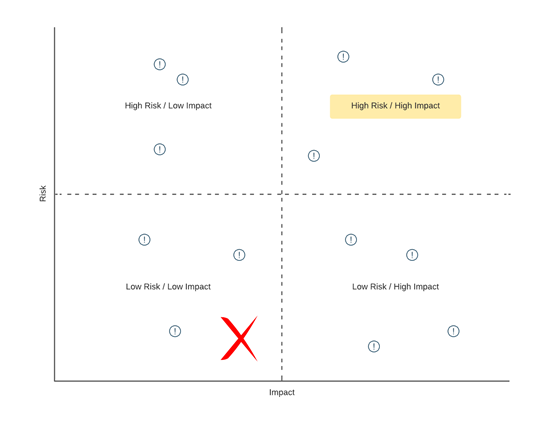

# Threat Modeling

Take a look at the telecommunications reference architecture described at https://github.com/chanakaudaya/solution-architecture-patterns/blob/master/industry-specific/Telecommunication-reference-architecture-pattern.md#adding-value-to-your-subscriber-base.

In your assigned breakout room, spend time discussing and documenting potential threats and attack vectors that you see in the defined architecture. Start by brainstorming as many potential attacks as you can think of. Then, as a team, organize by risk vs. impact:

Do not worry about being too technical in your descriptions - you are simply looking to think about and identify potential threats by type. Don't forget to include the following considerations:

* Hardware
* Software
* Data
* Network
* Breakdown by geographical region, industry, and technology
* Attacker-centric, asset-centric, and application-centric

Nominate someone from your breakout room to gather/document the results of the discussion. That person will present to the larger group when we come back together from our sub-teams.